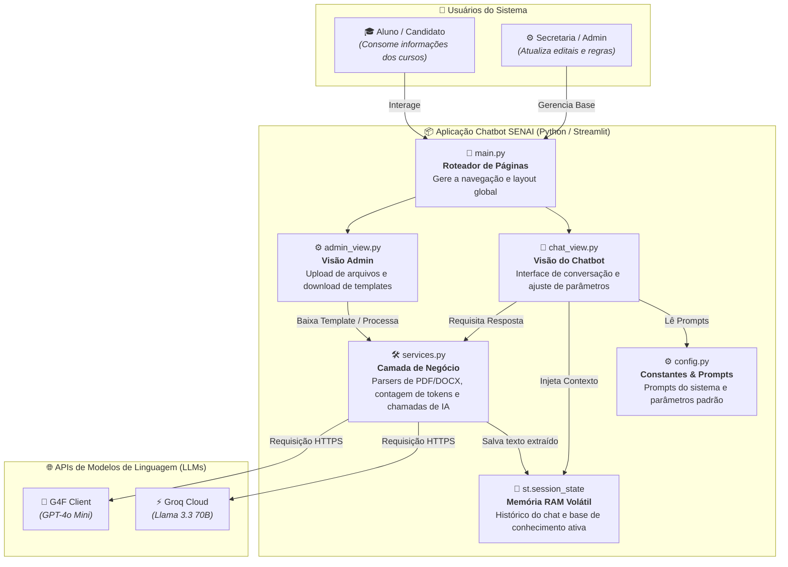

```mermaid
graph TB
    subgraph Actores ["👥 Usuários do Sistema"]
        Aluno["🎓 Aluno / Candidato<br/><i>(Consome informações dos cursos)</i>"]
        Admin["⚙️ Secretaria / Admin<br/><i>(Atualiza editais e regras)</i>"]
    end

    subgraph System ["📦 Aplicação Chatbot SENAI (Python / Streamlit)"]
        Router["🚀 main.py<br/><b>Roteador de Páginas</b><br/>Gere a navegação e layout global"]
        ChatUI["💬 chat_view.py<br/><b>Visão do Chatbot</b><br/>Interface de conversação e ajuste de parâmetros"]
        AdminUI["⚙️ admin_view.py<br/><b>Visão Admin</b><br/>Upload de arquivos e download de templates"]
        Services["🛠️ services.py<br/><b>Camada de Negócio</b><br/>Parsers de PDF/DOCX, contagem de tokens e chamadas de IA"]
        Config["⚙️ config.py<br/><b>Constantes & Prompts</b><br/>Prompts do sistema e parâmetros padrão"]
        SessionRAM["🧠 st.session_state<br/><b>Memória RAM Volátil</b><br/>Histórico do chat e base de conhecimento ativa"]
    end

    subgraph ExternalServices ["🌐 APIs de Modelos de Linguagem (LLMs)"]
        GroqAPI["⚡ Groq Cloud<br/><i>(Llama 3.3 70B)</i>"]
        G4FAPI["🤖 G4F Client<br/><i>(GPT-4o Mini)</i>"]
    end

    %% Relações
    Aluno -->|Interage| Router
    Admin -->|Gerencia Base| Router
    
    Router --> ChatUI
    Router --> AdminUI

    AdminUI -->|Baixa Template / Processa| Services
    Services -->|Salva texto extraído| SessionRAM

    ChatUI -->|Lê Prompts| Config
    ChatUI -->|Injeta Contexto| SessionRAM
    ChatUI -->|Requisita Resposta| Services

    Services -->|Requisição HTTPS| GroqAPI
    Services -->|Requisição HTTPS| G4FAPI
```