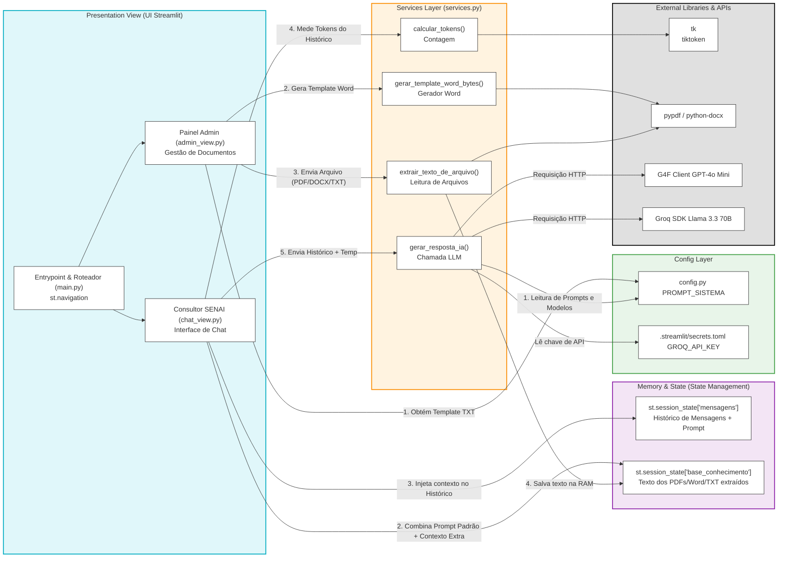

# Arquitetura do Sistema - FAQ SENAI

```mermaid
graph LR
    %% Definições de Estilo
    classDef blueSub fill:#e0f7fa,stroke:#00acc1,stroke-width:2px;
    classDef orangeSub fill:#fff3e0,stroke:#fb8c00,stroke-width:2px;
    classDef purpleSub fill:#f3e5f5,stroke:#8e24aa,stroke-width:2px;
    classDef greenSub fill:#e8f5e9,stroke:#43a047,stroke-width:2px;
    classDef blackSub fill:#e0e0e0,stroke:#000000,stroke-width:2px;
    classDef textNode fill:#fff,stroke:#333,stroke-width:1px;

    %% Subgrafos Coloridos
    subgraph Presentation_View ["Presentation View (UI Streamlit)"]
        MAIN["Entrypoint & Roteador (main.py)<br>st.navigation"]:::textNode
        CHAT["Consultor SENAI (chat_view.py)<br>Interface de Chat"]:::textNode
        ADMIN["Painel Admin (admin_view.py)<br>Gestão de Documentos"]:::textNode
        MAIN --> CHAT
        MAIN --> ADMIN
    end

    subgraph Services_Layer ["Services Layer (services.py)"]
        F_TOK["calcular_tokens()<br>Contagem"]:::textNode
        F_EXT["extrair_texto_de_arquivo()<br>Leitura de Arquivos"]:::textNode
        F_DOC["gerar_template_word_bytes()<br>Gerador Word"]:::textNode
        F_GEN["gerar_resposta_ia()<br>Chamada LLM"]:::textNode
    end

    subgraph Memory_State ["Memory & State (State Management)"]
        SS_MSG["st.session_state['mensagens']<br>Histórico de Mensagens + Prompt"]:::textNode
        SS_KB["st.session_state['base_conhecimento']<br>Texto dos PDFs/Word/TXT extraídos"]:::textNode
    end

    subgraph Config_Layer ["Config Layer"]
        CONFIG["config.py PROMPT_SISTEMA"]:::textNode
        SECRETS[".streamlit/secrets.toml GROQ_API_KEY"]:::textNode
    end

    subgraph External_Libraries ["External Libraries & APIs"]
        TIKTOKEN["tk<br>tiktoken"]:::textNode
        PARSERS["pypdf / python-docx"]:::textNode
        G4F["G4F Client GPT-4o Mini"]:::textNode
        GROQ["Groq SDK Llama 3.3 70B"]:::textNode
    end

    %% Conexões com Rótulos
    ADMIN -->|"2. Gera Template Word"| F_DOC
    ADMIN -->|"3. Envia Arquivo (PDF/DOCX/TXT)"| F_EXT
    ADMIN -->|"1. Obtém Template TXT"| CONFIG

    CHAT -->|"4. Mede Tokens do Histórico"| F_TOK
    CHAT -->|"5. Envia Histórico + Temp"| F_GEN
    CHAT -->|"2. Combina Prompt Padrão + Contexto Extra"| SS_KB
    CHAT -->|"3. Injeta contexto no Histórico"| SS_MSG

    F_EXT -->|"4. Salva texto na RAM"| SS_KB

    F_GEN -->|"Lê chave de API"| SECRETS
    F_GEN -->|"Requisição HTTP"| G4F
    F_GEN -->|"Requisição HTTP"| GROQ
    F_GEN -->|"1. Leitura de Prompts e Modelos"| CONFIG

    F_TOK --> TIKTOKEN
    F_DOC --> PARSERS
    F_EXT --> PARSERS

    %% Aplicação de Estilos
    class Presentation_View blueSub;
    class Services_Layer orangeSub;
    class Memory_State purpleSub;
    class Config_Layer greenSub;
    class External_Libraries blackSub;
```