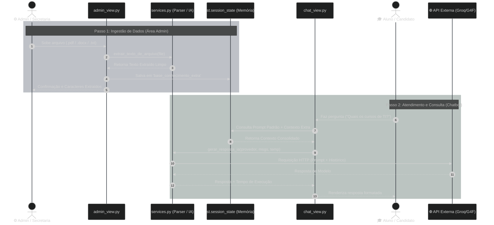

```mermaid
%%{init: {'theme': 'dark', 'themeVariables': { 'lineColor': '#58a6ff', 'actorLineColor': '#30363d'}}}%%
sequenceDiagram
    autonumber

    %% 1. DECLARAÇÃO ORGANIZADA DOS PARTICIPANTES
    actor Admin as ⚙️ Admin / Secretaria
    participant UI_Admin as admin_view.py
    participant Service as services.py (Parser / IA)
    participant RAM as st.session_state (Memória)
    participant UI_Chat as chat_view.py
    actor Aluno as 🎓 Aluno / Candidato
    participant LLM as 🌐 API Externa (Groq/G4F)

    %% 2. FLUXO DE INGESTÃO (ADMIN)
    rect rgba(40, 50, 70, 0.3)
        note over Admin, RAM: Passo 1: Ingestão de Dados (Área Admin)
        Admin->>UI_Admin: Sobe arquivo (.pdf / .docx / .txt)
        UI_Admin->>Service: extrair_texto_de_arquivo(file)
        Service-->>UI_Admin: Retorna Texto Extraído Limpo
        UI_Admin->>RAM: Salva em 'base_conhecimento_extra'
        UI_Admin-->>Admin: Confirmação e Caracteres Extraídos
    end

    %% 3. FLUXO DE CONSULTA (ALUNO)
    rect rgba(30, 60, 50, 0.3)
        note over Aluno, LLM: Passo 2: Atendimento e Consulta (Chatbot)
        Aluno->>UI_Chat: Faz pergunta ("Quais os cursos de TI?")
        UI_Chat->>RAM: Consulta Prompt Padrão + Contexto Extra
        RAM-->>UI_Chat: Retorna Contexto Consolidado
        UI_Chat->>Service: gerar_resposta_ia(provedor, msgs, temp)
        Service->>LLM: Requisição HTTP (Prompt + Histórico)
        LLM-->>Service: Resposta do Modelo
        Service-->>UI_Chat: Resposta + Tempo de Execução
        UI_Chat-->>Aluno: Renderiza resposta formatada
    end
```